# DociCome

# سامانه درمان سیار

## overview    
با توجه به شیوع اپیدمی کرونا، اغلب مردم از حضور در بیمارستان‌ها -از خوف ابتلا به این بیماری- جهت درمان بیماری‌های غیر حاد و انجام آزمایش‌ها امتناع می‌ورزند. به همین جهت برخی از این بیماری‌ها درمان یا شناسایی نمی‌شود و در نهایت موجب حاد شدن این بیماری‌ها می‌شود.
هدف این سامانه این است که دسترسی بیماران را به خدمات درمانی و پزشکان متخصص هر حوزه در محل حضور بیمار تسهیل کند.

# نحوه نصب پیش نیاز‌ها و اجرای پروژه:

## Install Requirements
    pip install -r requirements.txt 

## Run Server
    python3 manage.py runserver 0:8000

## Create Migrations
    python3 manage.py migrate

## Create Admin User
    python3 manage.py createsuperuser

# ویژگی‌های سامانه

### مشاهده امکانات وبسایت

## بیماران
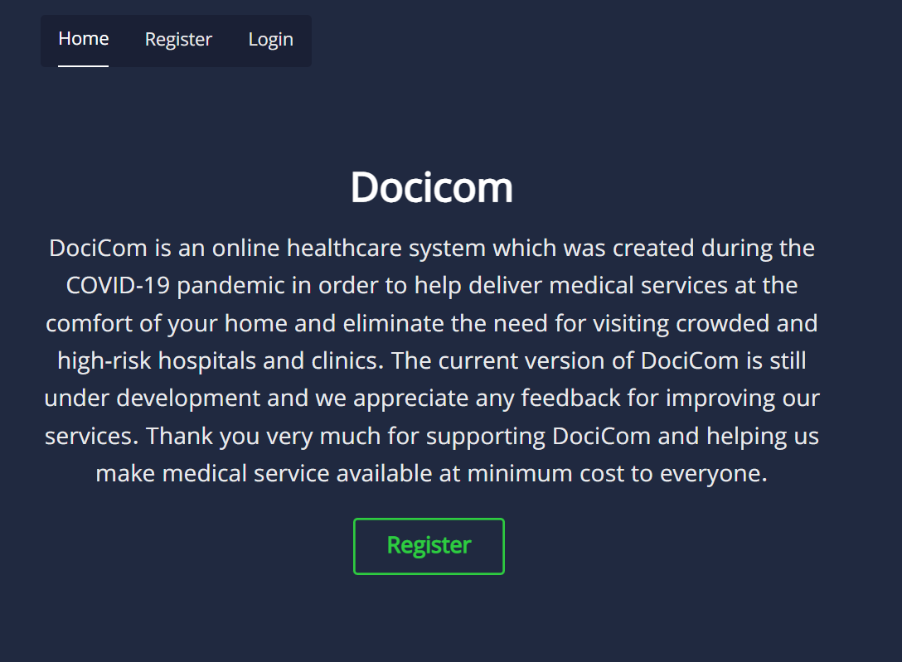
### امکان ورود و ثبت نام بیماران در سامانه
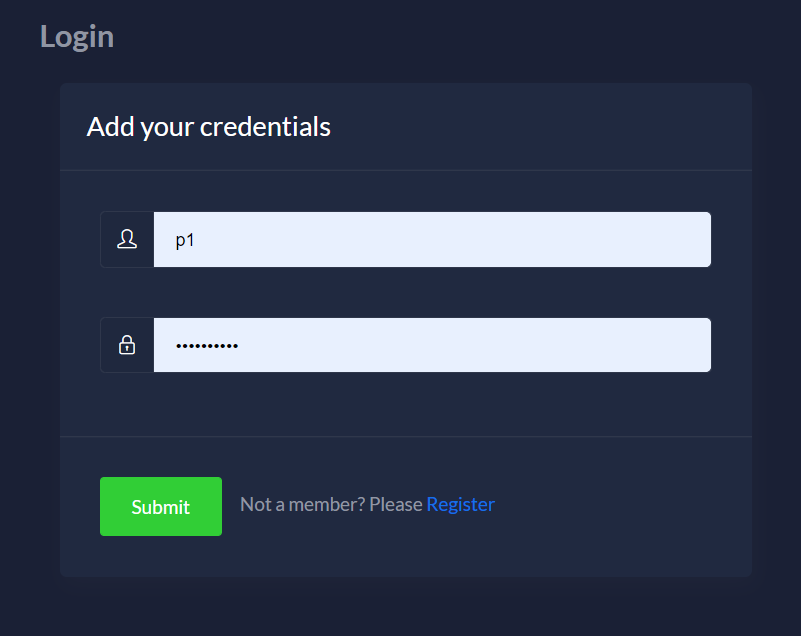
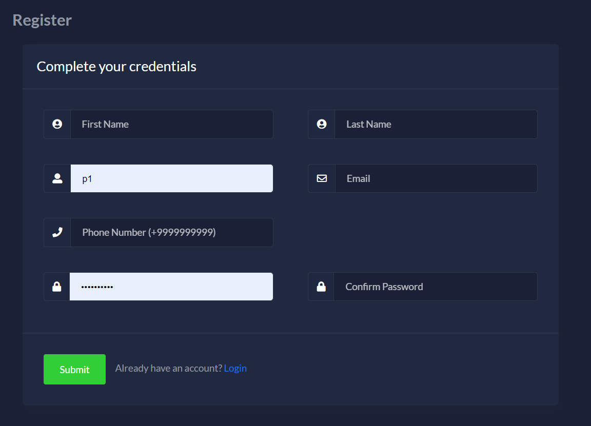
### امکان انتخاب خدمات مورد نیاز از میان لیست خدمات موجود
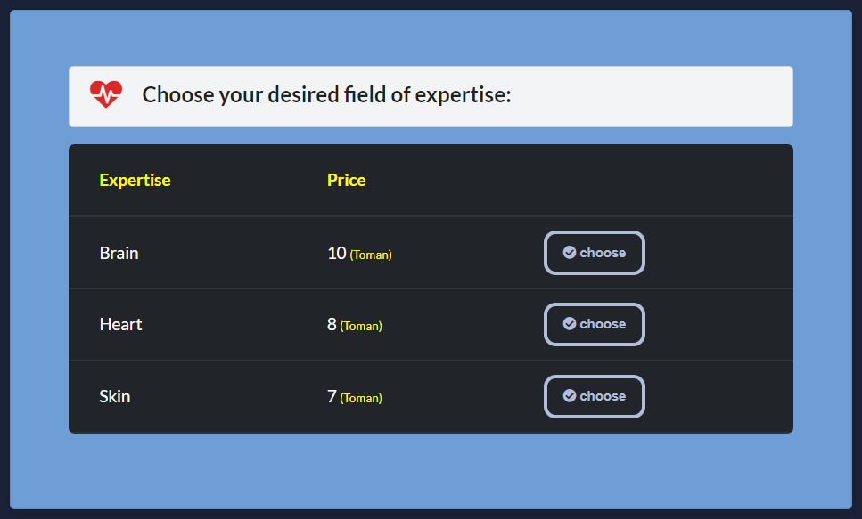
### امکان مشاهده درخواست‌های داده شده
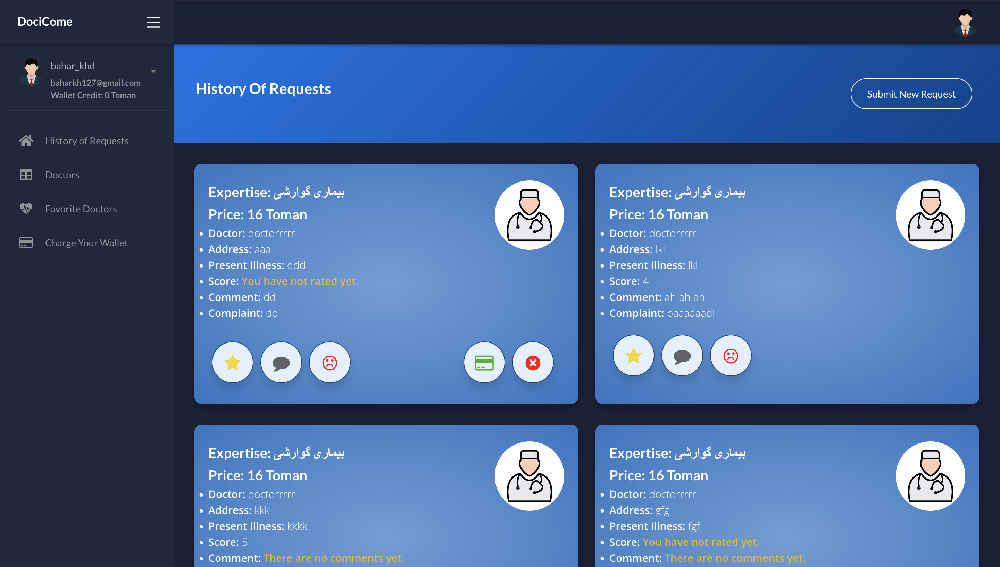
### امکان ثبت امتیاز

### امکان ثبت نظر
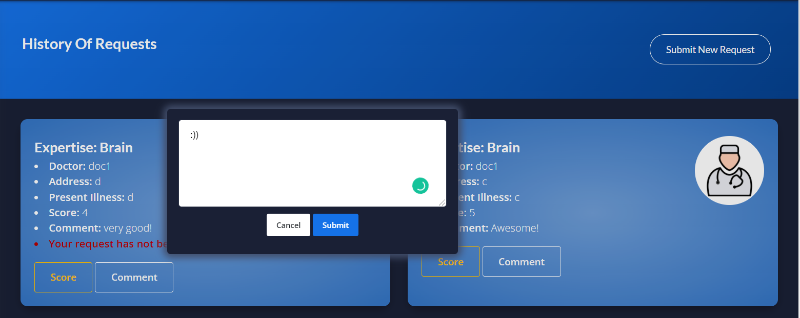
### امکان ثبت شکایت

### امکان مشاهده پزشکان هر تخصص
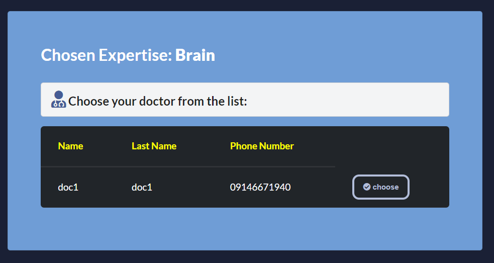
### امکان ثبت درخواست
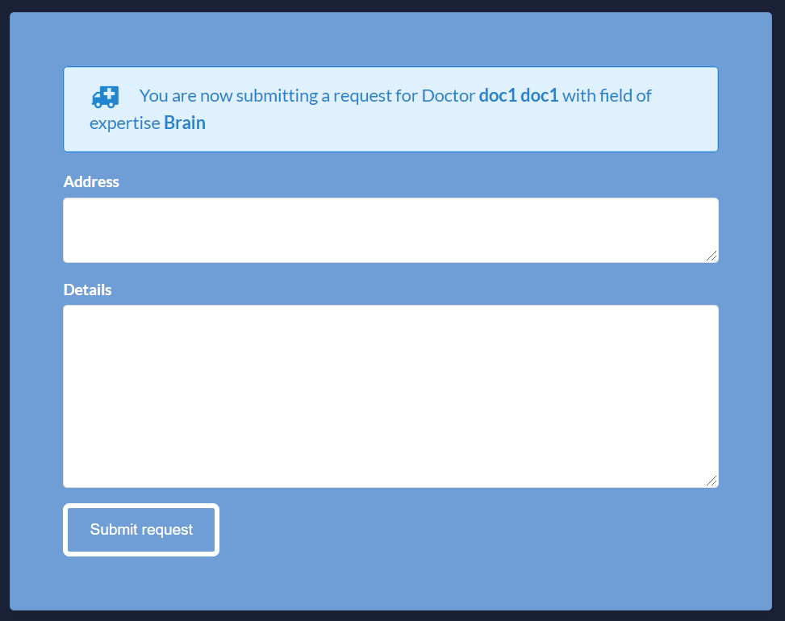
### مشاهده لیست پزشکان
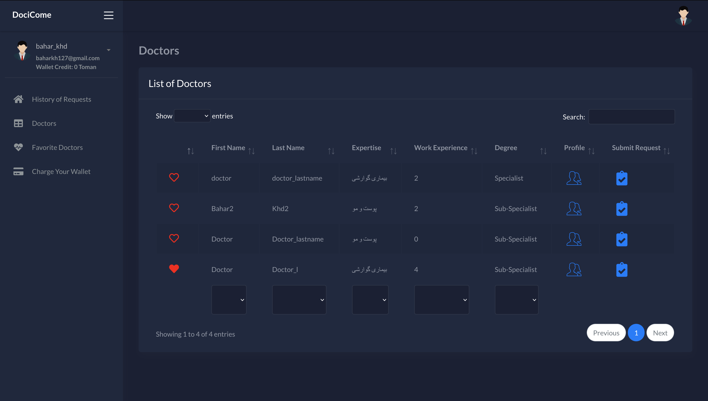
### مشخص کردن لیست پزشکان موردعلاقه و مشاهده لیست آنها
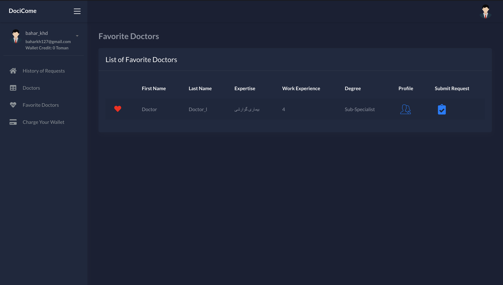
### شارژ کیف پول و پرداخت آنلاین
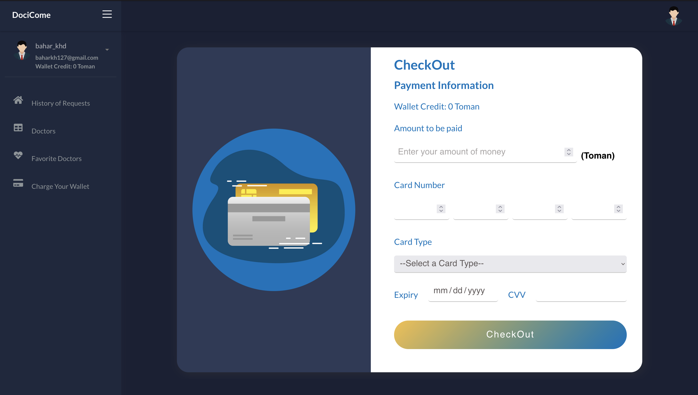
### مشاهده پروفایل پزشکان و ثبت درخواست مستقیم
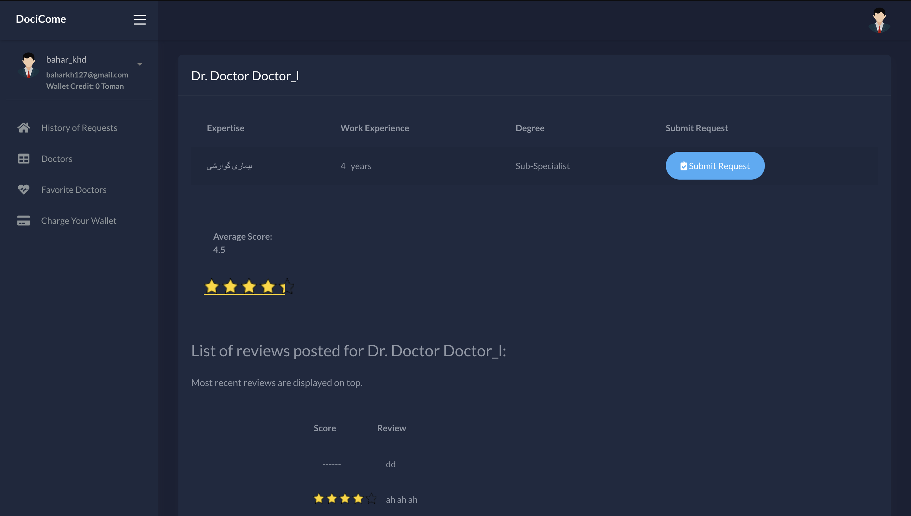

## پزشکان

### امکان ورود به سامانه 

### امکان مشاهده درخواست‌های موجود مرتبط با تخصص

### امکان مشاهده درخواست‌های پذیرفته شده
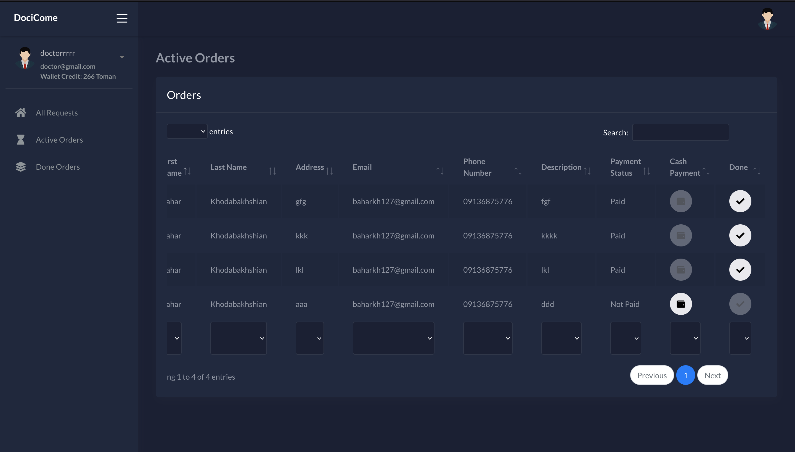
### امکان مشاهده درخواست‌های اتمام یافته
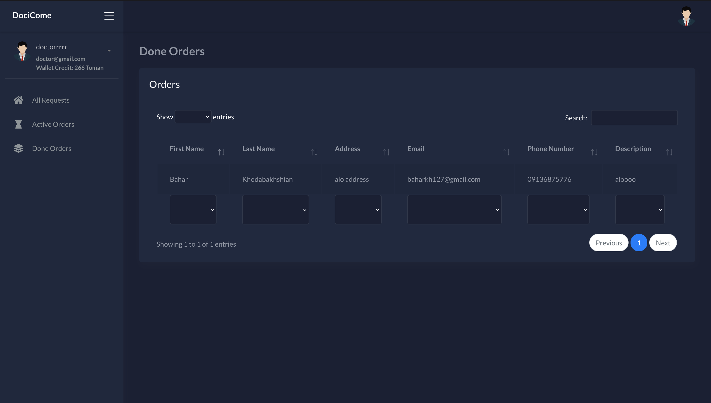
